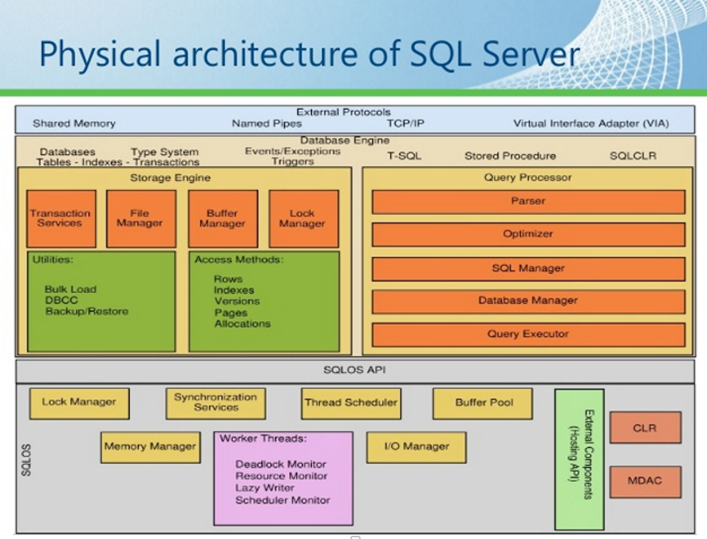
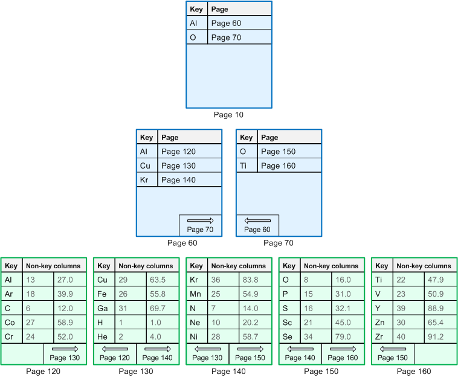
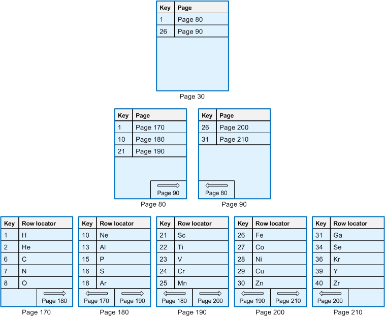

# SQL and MSSQL Server

---
<!-- _class: slide -->
# Structured Query Language (SQL)

See simple SQL tutorial [https://www.w3schools.com/sql/sql_intro.asp](https://www.w3schools.com/sql/sql_intro.asp)

---
<!-- _class: slide -->
# MSSQL RDBMS

SQL Server Layered architecture

---
<!-- _class: slide -->
# MSSQL Entities

## Database
- **master Database** -	records all the system-level information for an instance of SQL Server.
- **msdb Database** - is used by SQL Server Agent for scheduling alerts and jobs.
- **model Database** - is used as the template for all databases created on the instance of SQL Server.
- **tempdb Database** -	is a workspace for holding temporary objects or intermediate result sets.

## Tables and Views
- Primary/Foreign keys
- Unique and Check Constraints
- A **View** is a virtual table whose contents are defined by a query

## Stored Procedures and Functions
- **Stored Procedures** - a group of one or more Transact-SQL statements or a reference to a Microsoft .NET Framework common runtime language (CLR) method.
    * Accept input parameters and return multiple values in the form of output parameters to the calling program.
    * Contain programming statements that perform operations in the database. These include calling other procedures.
    * Return a status value to a calling program to indicate success or failure (and the reason for failure).
- **Functions (User-Defined)** - routines that accept parameters, perform an action, such as a complex calculation, and return the result of that action as a value.
    * Scalar Function - return a single data value.
    * Table-Valued Functions - return a table data type.

## Triggers
- **Logon triggers** - fire stored procedures in response to a LOGON event.
- **DDL triggers** - fire stored procedures in response to a variety of Data Definition Language (CREATE, ALTER, DROP, GRANT, DENY, REVOKE or UPDATE STATISTICS) events.
- **DML triggers** - fire stored procedures in response to a variety of Data Manipulation Language (INSERT, UPDATE, or DELETE) events.

## Indexes
- **Heaps** - A heap is a table without a clustered index. One or more nonclustered indexes can be created on tables stored as a heap.
    * Data is retrieved from a heap in order of data pages, but not necessarily the order in which data was inserted.
- **Clustered & Nonclustered Indexes** - index on the table that stores data pages
    * Clustered indexes sort and store the data rows in the table or view based on their key values. There can be only one clustered index per table.  
    * The only time the data rows in a table are stored in sorted order is when the table contains a clustered index.
- **Columnstore Indexes** - Columnstore indexes are the standard for storing and querying large data warehousing fact tables.
    * High performance gains for analytic queries that scan large amounts of data
    * High data compression inside te index
- **Full-Text Indexes** - lets users and applications run full-text queries against character-based data in SQL Server tables.
    * Queries can use special T_SQL statements and syntax (CONTAINS, FREETEXT, NEAR)

---
<!-- _class: slide -->
# Storage principles
- Data Pages
    * In SQL Server, data is organized in pages.
    * A page has a fixed size (8 KB).
    * Each page contains records.
    * The number of records that can be stored in a page depends on the size of the records.
    * The operation of reading data from a page is called a logical IO.

- **B-Tree structures** - SQL Server organizes indexes as trees, with one page at the root level, multiple pages at the leaf level, and zero or more levels in between.

    * Clustered Index B-Trees
        * Leaf level: The leaf level is the data of the table. It is composed of data pages. They store all the columns of the table for every row of the table.
        * Non-leaf levels: The non-leaf levels are composed of index pages.
    

    * Nonclustered Index B-Trees
        * Leaf level: The leaf level is the data of the table. It is composed of data pages. They store all the columns of the table for every row of the table.
        * Non-leaf levels: The non-leaf levels are composed of index pages.

    
    A nonclustered index for the clustered table.
    
    
    A nonclustered index for the heap.

The columns stored at the leaf of an index are called the columns covered by this index.

---
<!-- _class: slide -->
# Query Engine

---
<!-- _class: slide -->
# Transactions

---
<!-- _class: slide -->
